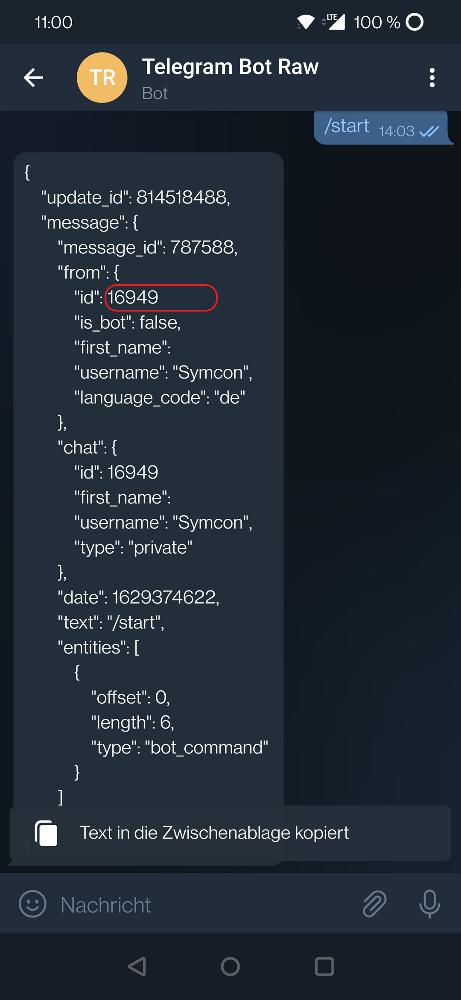

# TelegramBot
Erlaubt das Versenden von Nachrichten an angegebene Personen und Ausführen von Aktionen innerhalb von IP-Symcon.

### Inhaltsverzeichnis

1. [Funktionsumfang](#1-funktionsumfang)
2. [Voraussetzungen](#2-voraussetzungen)
3. [Telegram Bot erstellen](#3-telegram-bot-erstellen)
4. [Software-Installation](#4-software-installation)
5. [Einrichten der Instanzen in IP-Symcon](#5-einrichten-der-instanzen-in-ip-symcon)
6. [Aktionen](#6-aktionen)

### 1. Funktionsumfang

* Nachrichten versenden (an alle oder einzelne Personen)
* Bilder (aus Medien) versenden (an alle oder einzelne Personen)
* Auf Chat-Kommandos mit Aktionen reagieren

### 2. Voraussetzungen

- IP-Symcon ab Version 6.0
- Ein Telegram Bot

### 3 Telegram Bot erstellen
- Im Telegram-Client nach [BotFather](https://t.me/botfather) suchen 
- Mit `/newbot` wird ein neuer Bot erstellt
- Unter dem Benutzernamen kann der Bot gefunden werden und sollte daher mit beispielsweise zufälligen Zahlen bestückt werden
 

- Im Telegram-Client nach [RawDataBot](https://t.me/rawdatabot) suchen
- Wenn der Bot angeschreiben wird gibt dieser einige Daten zurück, aus denen die eigene BenutzerID entnommen werden kann
  - Dieser Vorgang muss für jeden Benutzer wiederholt werden, der von dem Bot erreicht werden soll
   

- Den Bot mit `/start` anschreiben um ihn zu starten

### 4. Software-Installation

* Über den Module Store das 'TelegramBot'-Modul installieren.
* Alternativ über das Module Control folgende URL hinzufügen

### 5. Einrichten der Instanzen in IP-Symcon

 Unter 'Instanz hinzufügen' kann das 'TelegramBot'-Modul mithilfe des Schnellfilters gefunden werden.  
	- Weitere Informationen zum Hinzufügen von Instanzen in der [Dokumentation der Instanzen](https://www.symcon.de/service/dokumentation/konzepte/instanzen/#Instanz_hinzufügen)

__Konfigurationsseite__:

Name              | Beschreibung
----------------- | ------------------
Bot API Key       | Der API Key des erstellten Bots
Bot Benutzername  | Der Benutzername des erstellten Bots
Benutzer          | Eine Liste von Benutzern, die vom Bot angeschrieben werden können
Aktionen          | List mit Befehlen und den dazugehörigen Aktionen

### 6. Aktionen

## **Verschicke Bild**

Mit dieser Aktion kann ein Bild an den ausgewählten Empfänger gesendet werden

### Parameter:
- Bild: Das Medienobjekt, welches versendet werden soll
- Empfänger: Ein bestimmter oder alle in der Benutzer-Liste definierten Personen

## **Verschicke Nachricht**

Mit dieser Aktion kann ein Nachricht an den ausgewählten Empfänger gesendet werden

### Parameter:
- Text: Der Inhalt der Nachricht
- Empfänger: Ein bestimmter oder alle in der Benutzer-Liste definierten Personen

[Mehr Informationen zur Nutzung von Aktionen](https://www.symcon.de/service/dokumentation/konzepte/automationen/ablaufplaene/aktionen/)